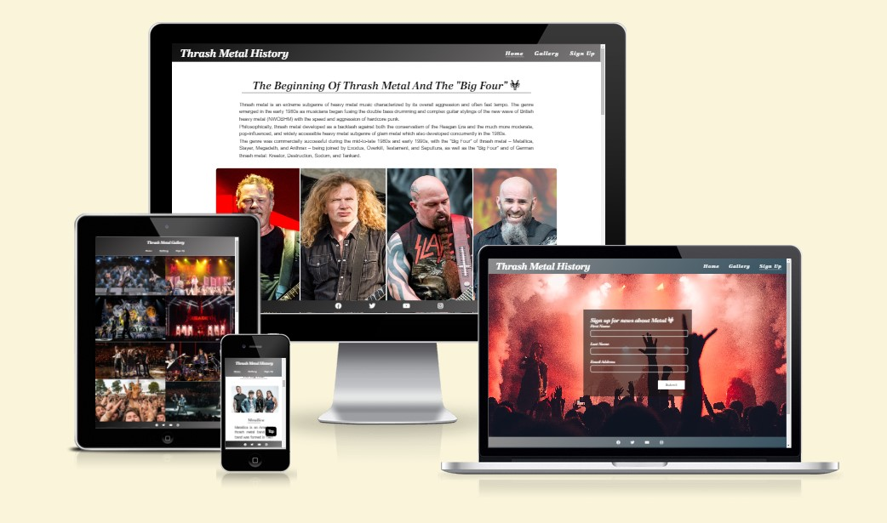
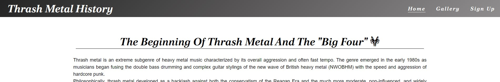
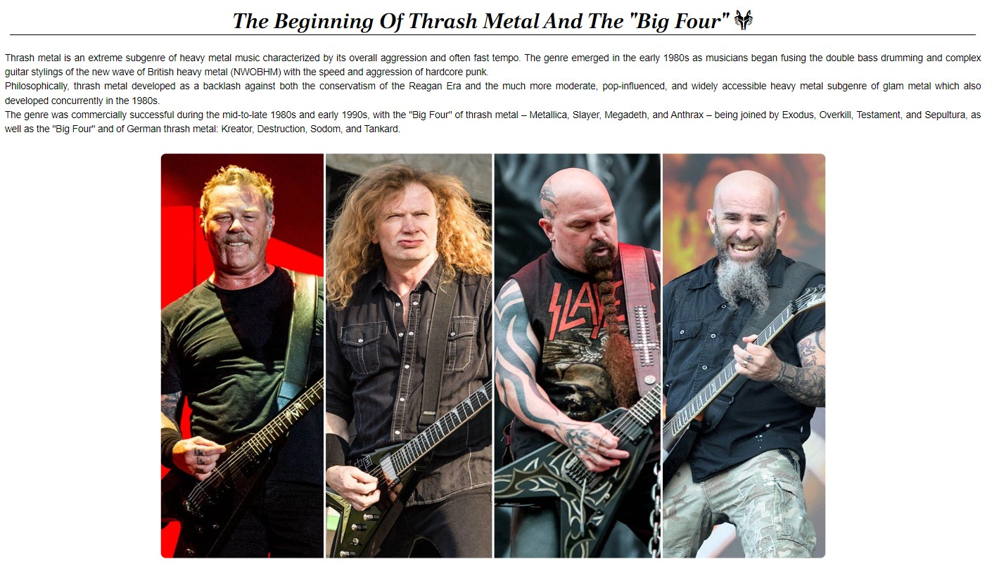
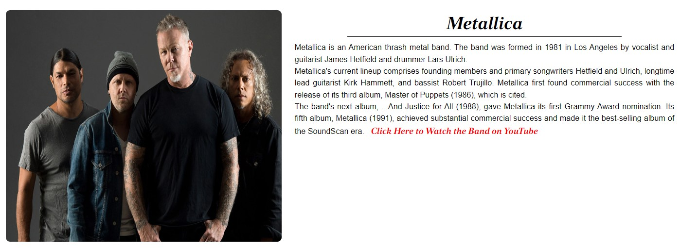
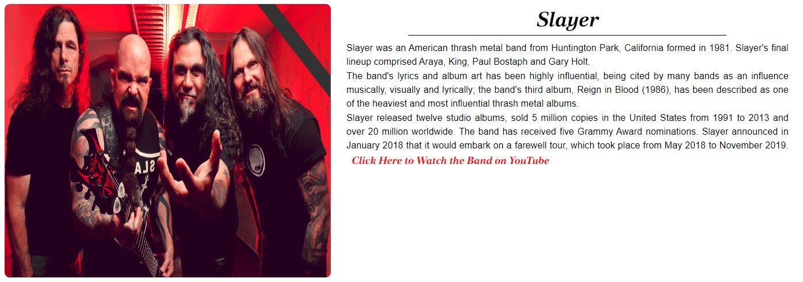
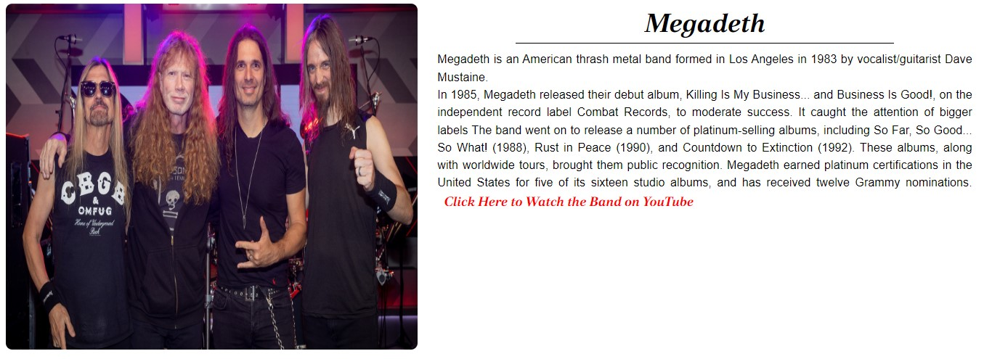
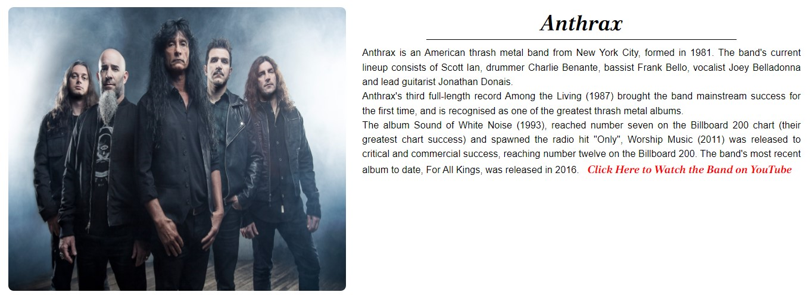
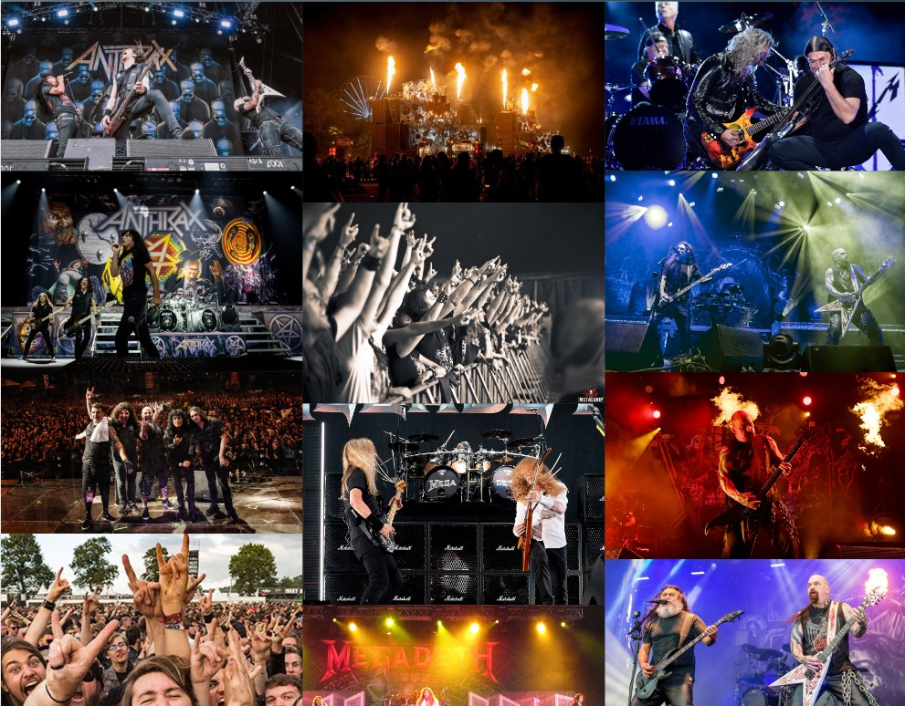
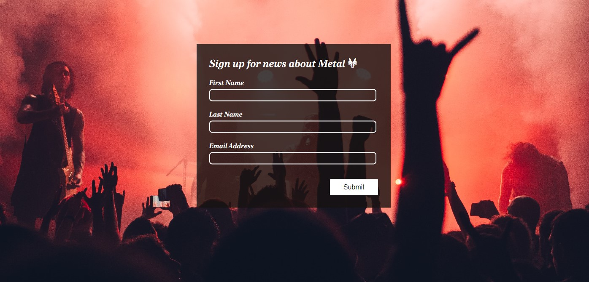
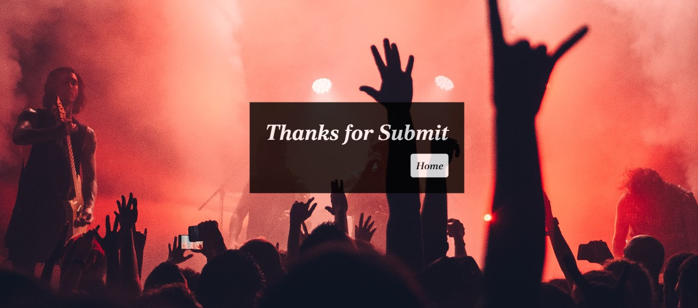

# Thrash Metal History

Thrash Metal History is a website that helps people learn a little about the world of Thrash Metal music. It gives the reader an introduction to the beginnings of the genre and which bands they should look out for to enjoy this energetic and incredible world of Metal.

[View the live project here](https://tcaldato.github.io/portfolio1-metal/index.html)

## UX

#### The ideal user for this website

- Current user
- New user

#### Current User Goals

1. They want to receive from the page all the information related to the Big Four Bands.
2. They want to easily navigate through the site and access the information they require with ease.
3. They want to easily navigate to content they have previously viewed.

#### New User Goals

1. They want to easily navigate the entire site intuitively.
2. They want the information they seek to be easily accessible and relevant.
3. They want attractive and relevant visuals and colour schemes that work with the content.

#### Development

To create a comprehensive website that answers the above users and identifies the functionality of the site, it was developed a website that bring the new user to identify which bands they should look for to understand the genre, and for current users, the website will bring the latest information about albums, and with the form, the current users will always be notified when something new is on the website.

#### Target Audience

- **Roles:**
  - Current users
  - New users
  - Beginner Headgangers

- **Demographic:**
  - All ages
  - All Countries/Cultures

- **Psychographic:**
  - Lifestyles:
    - Interest in Heavy Music
    - Reserved
  - Personality/Attitudes:
    - Quit
    - Independent
    - Creative

The website needs to enable the **user** to:

- Retrieve the desired information about The Big Four bands that influenced and created a new genre.

The website needs to enable the **site manager** to:

- Gather news about album releases and update the website with this informations.

#### Structure

- The website was organized in four pages:

    1. The [Home Page](https://tcaldato.github.io/portfolio1-metal/);
    2. The [Gallery Page](https://tcaldato.github.io/portfolio1-metal/gallery.html);
    3. The [Sign Up Page](https://tcaldato.github.io/portfolio1-metal/form.html);
    4. The [Page after submiting the Form](https://tcaldato.github.io/portfolio1-metal/submitform.html?first_name=sdgsdgsg&last_name=dgsdgsdgs&email_address=gssdgdsg%40sdgsd);

- Each Page separeted in three parts:

    1. The Header, with the Title of the Page and the menu items;
    2. The Body, with the specific information related with each page;
    3. The Footer, with all the links for the Social Network pages.

### Design

#### Color Scheme

 - The color palette was chosen based on the colors of the Thrash Metal "mood", the albums and Concerts. Dark colors, with a bit of blue, red and violet just to distinguish some parts of the webpage.

#### Typography

 - The typography pairing used on the site are [Poltawski Nowy]("https://fonts.googleapis.com/css2?family=Poltawski+Nowy:ital,wght@1,700&display=swap"), imported from [Google Fonts](https://fonts.google.com/). A backup of Sans-Serif had been applied in case of import failure.

#### The information

 - The selected information about the Thrash Metal History and the Big Four Bands came from [Wikipedia](https://www.wikipedia.org/)
  
## Features

Each page within the site has a consistent and responsive navigation system. The details of features on the site are detailed below.

### Existing Features

- **Navigation Bar**

  - Featured on all four pages, the full responsive navigation bar includes links to Home page, Gallery and Sign Up page and is identical in each page to allow for easy navigation.
  - This section will allow the user to easily navigate from page to page across all devices without having to revert back to the previous page via the ‘back’ button.
  - The Header is across the top of the page. It is static because cover just a smal part of the page,not influencing user experience, and had an animation using gradient colors. A back-to-top button was also implemented so users can access the top of the page quickly.

- **The Home Page image**

  - The landing includes an image and text to allow the user to see exactly which bands will be featured and how they started the Thrash Metal genre.
  - This section introduces the user to Thrash Metal History with an eye catching animation to grab their attention.  

- **The Big Four**

    - The Big Four will allow the user to see the Four main bands that created the genre, their albums that influenced others bands and their final lineups.
    - Each Section has a link to [YouTube](https://www.youtube.com/) that goes directly to the Bands page. The user can easily listen to the band and understand even better why they are so important for the genre.
    - This part was separated in 4 sections, each section talking about a specific band:

**1.** The First Band is Metallica:

**2.** The Second Band is Slayer:

**3.** The Third Band is Megadeth:

**4.** The Fourth Band is Anthrax:

- **The Footer**

    - The footer section includes links to the relevant social media sites for Thrash Metal History. The links will open to a new tab to allow easy navigation for the user.
    - The footer is valuable to the user as it encourages them to keep connected via social media
    - As the Navigation Bar, the Footer has an animation with the same gradient color.

- **The Gallery Page**

    - The Gallery page is valuable to the user as they will be able to have a glimpse to how the concerts of the 4 Bands are, how they influence the audience and how the Thrash Metal Festivals is fun.

- **The Sign Up Page**

    - This page will allow the user to get signed up to Thrash Metal History to get the news about Thrash Metal world. The user will be asked to submit their full name and email address.
    - This page is important to the user because they can start to be informed and make part of the community of Thrash Metal.  

- **The Page after the Sign Up**

    - This page is relevante to the user because, after they send the form to be part of the community of Thrash Metal, this page will show a **Thank You** message, to give the certainty that the form was sent and now they will be part of this great community.
    - It was added a **Home** button to give the user the facility to go back to the Home Page after the submission of the form.

- **Features Left to Implement**
    bs
    sb
    sb
    sb...
## Testing

sddssdsd...

- **Validator Testing**

- HTML
  - No errors were returned when passing through the official [W3C validator]()
- CSS
  - No errors were found when passing through the official [(Jigsaw) validator]()
