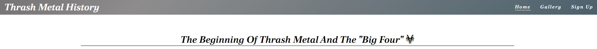

# Thrash Metal History

Thrash Metal History is a website that helps people learn a little about the world of Thrash Metal music. It gives the reader an introduction to the beginnings of the genre and which bands they should look out for to enjoy this energetic and incredible world of Metal.

[View the live project here](https://tcaldato.github.io/portfolio1-metal/index.html)

## UX

#### The ideal user for this website

- Current user
- New user

#### Current User Goals

1. They want to receive from the page all the information related to the Big Four Bands.
2. They want to easily navigate through the site and access the information they require with ease.
3. They want to easily navigate to content they have previously viewed.

#### New User Goals

1. They want to easily navigate the entire site intuitively.
2. They want the information they seek to be easily accessible and relevant.
3. They want attractive and relevant visuals and colour schemes that work with the content.

#### Development

To create a comprehensive website that answers the above users and identifies the functionality of the site, it was developed a website that bring the new user to identify which bands they should look for to understand the genre, and for current users, the website will bring the latest information about albums, and with the form, the current users will always be notified when something new is on the website.

#### Target Audience

- **Roles:**
  - Current users
  - New users
  - Beginner Headgangers

- **Demographic:**
  - All ages
  - All Countries/Cultures

- **Psychographic:**
  - Lifestyles:
    - Interest in Heavy Music
    - Reserved
  - Personality/Attitudes:
    - Quit
    - Independent
    - Creative

The website needs to enable the **user** to:

- Retrieve the desired information about The Big Four bands that influenced and created a new genre.

The website needs to enable the **site manager** to:

- Gather news about album releases and update the website with this informations.

#### Structure

- The website was organized in four pages:

1. The ;
2. The ;
3. The ;
4. The ;

- Each Page separeted in three parts:

1. The Header, with the Title of the Page and the menu items;
2. The Body, with the specific information related with each page;
3. The footer, with all the links for the Social Network pages.

### Design

#### Colour Scheme

The colour palette was chosen based on the colors of the Thrash Metal "mood", the albums and Concerts. Dark colors, with a bit of blue, red and violet just to distinguish some parts of the webpage. 

#### Typography

The typography pairing used on the site are [Poltawski Nowy]("https://fonts.googleapis.com/css2?family=Poltawski+Nowy:ital,wght@1,700&display=swap"), imported from [Google Fonts](https://fonts.google.com/). A backup of Sans-Serif had been applied in case of import failure.

#### The information

The selected information about the Thrash Metal music and the Big Four Bands came from [Wikipedia](https://www.wikipedia.org/)

Images of the Concerts of the Big Four Bands and Festivals have been sourced from the websites:

- [Art Station](https://www.artstation.com/).
- [Art Station](https://www.artstation.com/).
- [Art Station](https://www.artstation.com/).
- [Art Station](https://www.artstation.com/).
- [Art Station](https://www.artstation.com/).
- [Art Station](https://www.artstation.com/).

  
## Features

Each page within the site has a consistent and responsive navigation system. The details of features on the site are detailed below.

### Existing Features

- **Navigation Bar**

  - Featured on all three pages, the full responsive navigation bar includes links to Home page, Gallery and Sign Up page and is identical in each page to allow for easy navigation.
  - This section will allow the user to easily navigate from page to page across all devices without having to revert back to the previous page via the ‘back’ button.

- **The landing page image**

  - The landing includes an image and text to allow the user to see exactly which bands will be featured and how they started the Thrash Metal genre.
